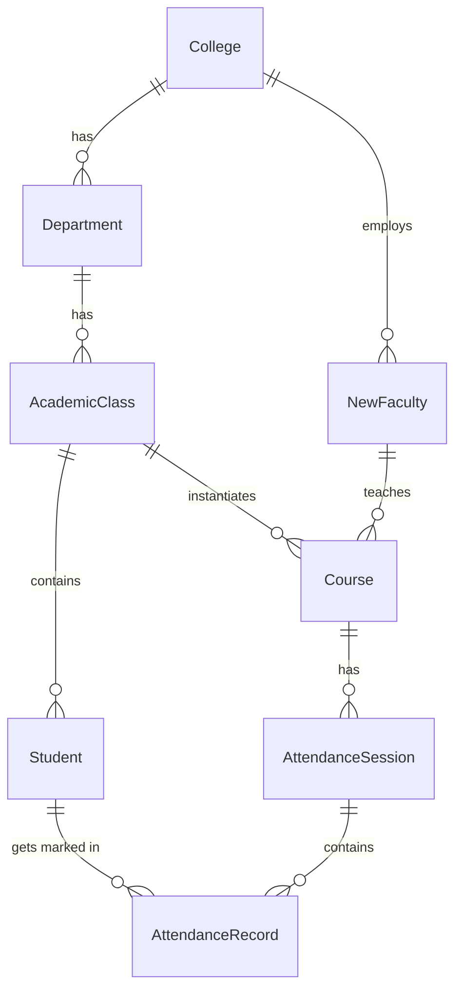

# Present Sir - System Architecture & Workflows

## 1. High-Level Architecture Overview

The system is a Django-based monolithic web application providing management and attendance tracking for educational institutions. It serves two primary user roles:
- **College Admins**: Manage institutional structures (departments, classes, faculty assignments).
- **Faculty Members**: Manage course attendance, student profiles, and personal classes.

### Core Database Entities structure

## 2. Authentication & Authorization Flow

The application uniquely uses a dual-auth system (supporting both traditional Django sessions and JWT tokens for API consumers).

1. **Faculty Registration/Login Pipeline**:
   - Uses Email OTP verification.
   - OTP is generated and cached/stored in session.
   - Once OTP is verified, faculty can complete registration (`faculty_reg_id` auto-generated uniquely).
   - Sessions or JWT (`api/jwt/login/`) handle persistent authentication.

2. **College Admin Authentication**:
   - Manages institutional operations.
   - Directly authenticates through session or JWT using `admin_email` and `password`.
   - Cannot manage individual attendances but can assign courses to faculty.

## 3. Institutional Structure Workflows

### A. Core Structure Setup (Admin)
1. **Create Department**: Requires OTP verification before committing the create action.
2. **Create Academic Class**: Defines the `AcademicClass` specifying `class_name`, `section`, and `batch`. 
3. **Register Students**: Added via bulk JSON requests. Links directly to the `College` and `AcademicClass` entities.

### B. Course & Assignment Management
1. **Department Courses**: Templates of courses representing subjects (e.g., Core, Elective, Lab).
2. **Faculty Assignment**: College Admin assigns a `DepartmentCourse` to a `NewFaculty` for a specific `AcademicClass`.
3. **Instantiation**: This assignment spins up a `Course` model tying `Faculty`, `AcademicClass`, and `Student` lists.

## 4. Attendance Management Workflow (Faculty)

### A. Class Initialization
- **Official Classes**: Synced automatically to the Faculty's dashboard once assigned.
- **Personal Classes**: Faculty can create private classes linked strictly to themselves (`is_personal=True`). Students created under personal classes exist in isolation and do not sync to the college's main roster.

### B. Attendance Marking
1. Faculty selects a date and session period (e.g., periods 1 to 2).
2. API (`/api/save-attendance/`) locks the table row temporarily `select_for_update()` to prevent double-marking.
3. System verifies conflict: Validates no overlapping session exists for the same `course` and `date`.
4. Uses `bulk_create` to rapidly submit 100+ `AttendanceRecord` rows at once.
5. Real-time background calculations update the global caches to reflect new percentages.

## 5. Analytics & Dashboard Data Logic

The dashboard uses high-performance data patterns to aggregate large arrays of attendance:
- Relies heavily on **Django aggregates** (`Sum`, `Case`, `When`) vs Python iterations.
- Caches overall dashboard statistics per faculty for 5 to 10 minutes (Redis/Memcached).
- Automatically calculates Safe thresholds (the 75% rule margin) to proactively warn students.

## 6. End-Of-Semester Workflows
- Features to "Archive" classes, "Start New Semester", and calculate final rollouts.
- All high-stakes actions like `delete_department` or `execute_end_semester` require a strong secondary OTP action constraint.
